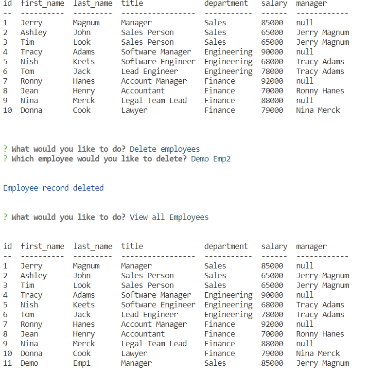

# Employee Tracker

## Description

This is a command line application for managing employees in a database.
The front end uses inquirer packages to display questions to users to answer.
The backend is a mysql database. They are connected via api's build using express.

Users can use the application for the following operations:
    View/Add/Update/Delete Employees    
    View/Add/Delete Roles
    View/Add/Delete Departments
     
## Table of Contents
    
- [Installation](#installation)
- [Usage](#usage)
- [Questions](#questions)
    
       
## Installation
    
To run the command line application.
- Clone the repository
- Run npm install

## Usage

Open two command line windows:
    - Update environment variables in .env file.
    - Connect to required mysql database. Run the commands.
        source db/db.sql
        source db/schema.sql
      For test data run command
        source db/seed.sql        
    - Run node server - on one to run the api.
    - Run node index - on second one to choose operations.

## Command line app screenshot

## Link to demo video

Use the following video to access a short demo on the application.
https://drive.google.com/file/d/1AdG0T8jm_Rj0HMUp_TKH2PAmRWvT1qSD/view

# Questions

if you have any questions about the repository, open an issue/pr or contact me directly at megha.nambiar@gmail.com 
You can find more of my work at [Github](https://github.com/meghark).

    